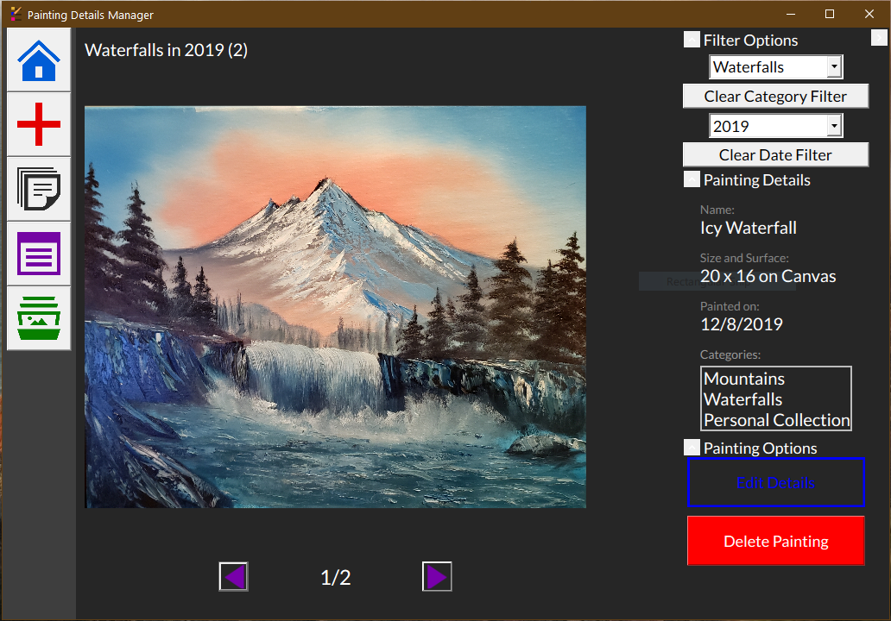
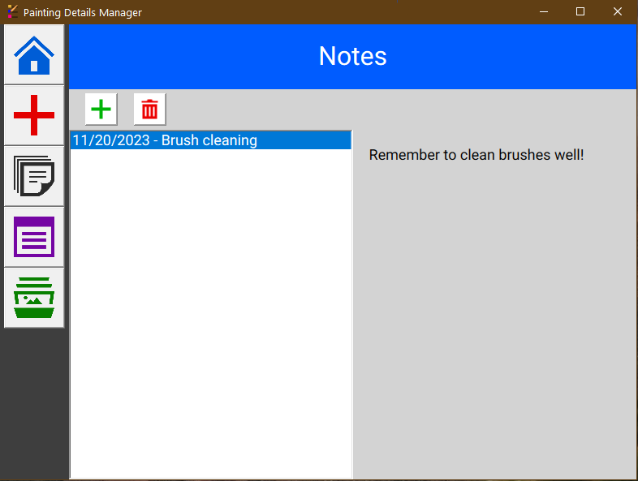

# Painting-Manager

## What it is and the Purpose
This is a solution for keeping track of paintings. This project grew out of me trying to make a little extra money selling some of my landscape oil paintings. For management, 
I was trying to literally glue small pictures, thumbnails, of my paintings into a spiral notebook and write down the dates I painted them, what size they were, and how much I wanted to charge for them, etc. Then I would mark if I sold them, the amount, etc. Eventually, I lost interest in actually making any real money out of my paintings but I still wanted a way to keep track of them and have an ordered gallery of my paintings, along with the details of the paintings. I also wanted to categorize them. I wanted a solution that did not involve writing dates or sizes on top of my pictures, nor try and work with the image details of the actual files, because that wouldn't work if I found a better or more up to date picture of a painting. So, the idea of building a painting manager was born, and I spent the greater part of a summer building this desktop application to do the job.

## Features
The most prominent (and useful) feature is the gallery, which allows you to view paintings by filtering. Additionally, you can see the details of a painting, such as its size, painting type, and what categories it is in.

    

Other useful features include the Notes section, which allows me to note down things quickly that I used to scribble down on pieces of scrap paper all over my desk.

    

## Where the Project is Now
At current, the project is *mostly* finished. The main thing that doesn't feel quite complete to me is the user interface. I feel the UI is a little sloppy (the gallery in particular) and could use a reworking to make it much more cleaner and modern--I have worked on that slightly so it does look better.

My plans, currently in execution, are to build a .NET MAUI mobile app and a Web API. The .NET MAUI app will be a mobile version of the app, which may actually be more practical since pictures of a painting would likely be taken on a phone. The Web API would exist to synchronize the data between the two apps. I'm currently building a prototype of the functionality.

Also super important is to get some type of installer so the non-programmers can easily install the program. By saving that for a little later, I can figure out all the details of how to build a proper installer for the multiple components. 

## If you are interested...
For those interested in building off of this for C#/WPF purposes, feel free to clone it and use it, or if you have your own artwork you would like to categorize, go for it! However, the project, in its current status, is a Visual Studio Project--it's not an installable software (not yet anyway).
